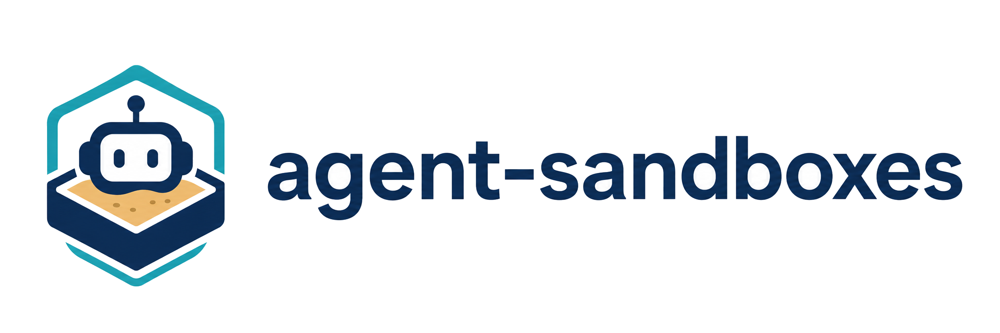

<p align="center">
  <picture>
    <source media="(prefers-color-scheme: dark)" srcset="docs/images/agent-sandboxes-wide-dark.png" />
    
  </picture>
</p>

<p align="center">
  <b>Sandboxed execution environment for AI coding agents</b>
</p>

Works with Claude Code, OpenAI Codex CLI, GitHub Copilot CLI, OpenCode, and the
xAI Grok CLI.
Provides kernel-level isolation (gVisor), network policy enforcement (Cilium),
and filesystem masking. Design intent and operator guidance in
[PRINCIPLES.md](PRINCIPLES.md).

## When to use this

Use this sandbox when you want an AI agent to run shell commands, edit
files, and reach the network on your behalf — **and you don't fully
trust what it might do**. Each session runs in its own gVisor-isolated
pod with a default-deny egress policy: the agent can only reach the
domains its tier whitelists, can't see your `~/.ssh/`, `~/.aws/`, or
`~/.kube/`, and any destructive command it runs is contained to a
single pod that you can `sandbox stop` at any time.

You probably **don't** need this if you're just chatting with an LLM
through its hosted UI, or running the official CLI yourself on a repo
you'd let any colleague edit. The sandbox exists for the "agent
autonomously executes things" case — code generation, infra work,
multi-step tasks — where a mistake or jailbreak could touch real
systems.

Before your first session, skim **[PRINCIPLES.md](PRINCIPLES.md)** — it covers
what this sandbox defends against, what it doesn't, and your accountability
as the operator (credential handling, tier escalation, what's never
permitted regardless of configuration).

## Quick Start

Linux and macOS — the happy path is below. **Windows users:** follow the
[Windows / WSL2 setup](docs/how-to/platforms/windows.md) guide instead. The
full walkthrough, including Tier 2/3 and options, is in
[Your first session](docs/tutorials/first-session.md).

> **Behind a TLS-intercepting proxy (Zscaler, Netskope, etc.)?** Run
> `./bin/sandbox setup-proxy-cert` before you install — see
> [Corporate TLS-intercept proxies](docs/how-to/tls-intercept-proxies.md).

```bash
# 1. Put the CLI on PATH and load completions (add to your shell rc to persist).
export PATH="$(pwd)/bin:$PATH"
source bin/completions/sandbox.bash   # or sandbox.zsh

# 2. Install prerequisites (k3s + Cilium + gVisor on Linux; Lima VM on macOS).
sandbox install                       # thin wrapper over ./setup.sh

# 3. Smoke-test the install.
sandbox status

# 4. Launch a Tier 1 session. First run walks you through OAuth in a browser.
sandbox run --agent claude --tier 1

# 5. Launch a Tier 2 session against a git repo.
sandbox run --agent claude --tier 2 --repo ~/repos/my-project

# List sessions, view logs, resume a still-running one.
sandbox list
sandbox logs   ses-20260401-143022-a7b3
sandbox resume ses-20260401-143022-a7b3
```

Once the CLI is on your PATH, `sandbox install` / `sandbox uninstall` are
equivalent to running `./setup.sh` / `./uninstall.sh` directly. `sandbox upgrade`
updates the CLI itself to the latest release (see
[Updating the CLI](docs/how-to/updating-the-cli.md)); `sandbox upgrade --infra`
rolls the pinned k3s / Cilium / gVisor versions forward (see
[Upgrading infrastructure](docs/how-to/upgrading-infra.md)).

## Tiers

| Tier | Workspace        | Requirements                                                  |
|------|------------------|---------------------------------------------------------------|
| 1    | emptyDir         | none                                                          |
| 2    | hostPath repo(s) | `--repo` (repeatable, each must be a git repo)                |
| 3    | hostPath repo(s) | `--repo` + at least one of `--infra-token` / `--infra-kubeconfig` |

Each tier widens the egress allowlist and (for Tier 3) swaps in an infra
tooling image. Full per-tier domain lists and the supported-agent allowlists
are in [Agents & tiers](docs/reference/agents-and-tiers.md).

## Documentation

Full docs live in **[docs/](docs/index.md)**. Quick links:

**Get started** — [Your first session](docs/tutorials/first-session.md) ·
[Windows / WSL2](docs/how-to/platforms/windows.md) ·
[Deploy an MCP dependency](docs/tutorials/mcp-dependency.md)

**How-to** — [Profiles & overlays](docs/how-to/profiles-and-overlays.md) ·
[Persistent domains & block list](docs/how-to/persistent-domains.md) ·
[Secrets](docs/how-to/secrets.md) ·
[MCP & service deps](docs/how-to/mcp-and-dependencies.md) ·
[Tier 3 infra credentials](docs/how-to/tier3-infra-credentials.md) ·
[Resuming sessions](docs/how-to/resuming-sessions.md) ·
[Corporate VPN](docs/how-to/corporate-vpn.md) ·
[TLS-intercept proxies](docs/how-to/tls-intercept-proxies.md) ·
[Rebuilding images](docs/how-to/rebuilding-images.md) ·
[Running tests](docs/how-to/running-tests.md) ·
[Uninstalling](docs/how-to/uninstalling.md)

**Reference** — [CLI](docs/reference/cli.md) ·
[Agents & tiers](docs/reference/agents-and-tiers.md) ·
[Configuration](docs/reference/configuration.md) ·
[Audit logs](docs/reference/audit-logs.md) ·
[Platform requirements](docs/reference/platform-requirements.md)

**Understand** — [Security model](docs/explanation/security-model.md) ·
[Architecture notes](docs/explanation/architecture.md) ·
[How this compares](docs/explanation/comparisons.md) ·
[PRINCIPLES.md](PRINCIPLES.md)

**Stuck?** — [Troubleshooting](docs/explanation/troubleshooting.md)

## License

Copyright 2026 Samaritan's Purse

The code authored by Samaritan's Purse in this repository is licensed under
the Apache License, Version 2.0. See the [LICENSE](LICENSE) file for the full
terms and the [NOTICE](NOTICE) file for third-party attributions.
